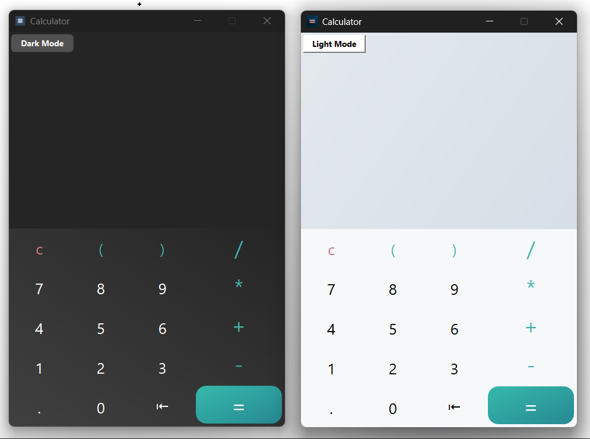

# Qt Calculator

A simple cross-platform calculator built using **C++** and **Qt Widgets** (using Qt Creator).  
Supports keyboard input, history, basic arithmetic operations, backspace, dark/light mode toggle, and more.

---

## &#10070; Installation 

-  and install on windows
  
---

## &#10070; Features

- Responsive numpad UI
- Keyboard support for numbers and operations
- Operation history display
- Light/Dark mode toggle
- Fixed window size
- Works on Windows and Linux

---
## &#10070; Screenshot



---

## &#10070; Technologies

- **C++**
- **Qt 5 / Qt 6**
- Qt Creator (Open Source Edition)

---

## &#10070; Build Instructions (Linux/Windows)

### Requirements

- Qt 5.15+ or Qt 6.x
- Qt Creator
- g++ or MSVC compiler

### Steps

```bash
git clone https://github.com/one-1man/qt-calculator.git
cd qt-calculator
qtcreator ./calculator.pro
```

## &#10192; License Notice

This app is built using the Qt framework under the LGPLv3 license.
You can learn more about Qt licensing at: https://www.qt.io/licensing
